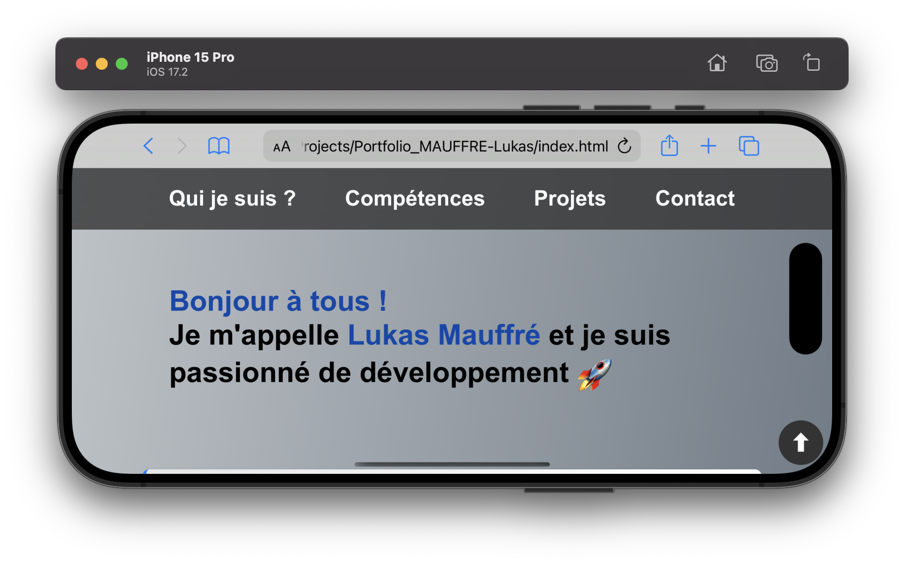
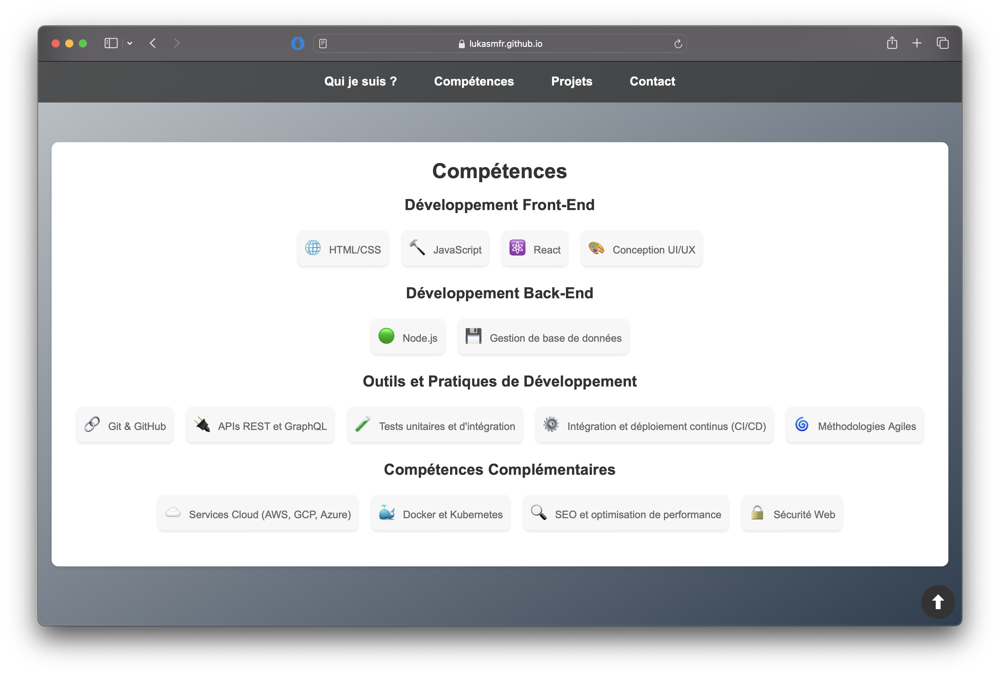
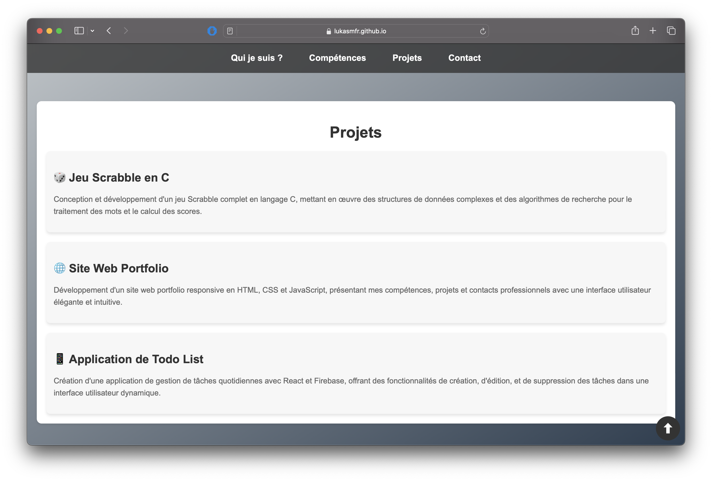

# This is a project for school.

## A simple Portfolio website

This is a simple portfolio website for a school project. It is built using HTML and CSS only.

This website should work well on all devices, including mobile phones and tablets.

It was even optimized for safe areas on iPhone X and newer.

### iPhone Optimization

This screenshot demonstrates the website's optimization for iPhones with notch displays, ensuring a seamless user experience across all modern iPhone models.

## Screenshots

Below are additional screenshots showcasing different sections of the website as viewed in Safari on a Mac.

### Skills Section

This screenshot displays the Skills section of the portfolio website, highlighting the various technical and soft skills presented in a visually engaging manner.

### Projects Section

Here, the Projects section is shown, featuring a compilation of notable projects and assignments completed, each accompanied by brief descriptions and visuals where applicable.
